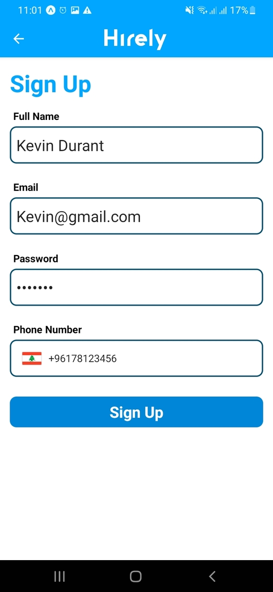

<div align="center">

> Hello world! This is the project’s summary that describes the project plain and simple, limited to the space available. 



</div>

<br><br>


>Hirely is an app that connects recruites with job seekers. It's purpose is to allow the job seeker to upload his CV and personal details to the app so that recruiters can check them out, as well as, recruiters will be able to post job offers with description and requirements, to be displayed to the job seeker.
> 
### User Stories
- As a job seeker, I want to apply for a suitable job according to my skills and knowledge.
- As a job seeker, i want to search a specific position I'm interested in.
- As a job seeker, I want to upload my CV and showcase my experiences and skills.
- As a job seeker,  I want to be in touch with recruiters to demonstrate my knowledge in the wanted position.
>
- As a recruiter, I want to post a job offer so that interested applicants can apply
- As as recruiter, I want the check out profiles of applicants who applied for the job I posted.
- As a recruiter, I want to message an applicant I am interested in.

<br><br>


> The below screenshots show some aspects of the design that was planned before on paper, then moved to Figma app for the fine details.


| Landing/Log In  | My Jobs/Add Job |
| -----------| -----|
|  ||

| Chats/Conversation  | My Profile/View Job Offer  |
| -----------------| -----|
|  |  |


<br><br>


Here's a brief high-level overview of the tech stack used in Hirely:

- React Native, a JavaScript framework for writing mobile applications.
- Laravel, a PHP framework. It follows a model-view-controller design pattern.
- MySQL, a relational database management system (RDBMS) that is based on structured query language (SQL).
- Firebase is a Google-backed application development software that enables developers to develop iOS, Android and Web apps. Firebase provides tools for tracking analytics, reporting and fixing app crashes, creating marketing and product experiment.


<br><br>


> Using the above mentioned tech stacks and the wireframes build with figma from the user sotries we have, the implementation of the app is shown as below, these are some screenshots from the real app

| Splash screen | Signup | Complete Profile |
|----------|-----------|-----------|
|  |  |  |


| Jobs | Realtime Chatting | Add Job  |
|----------|-----------|-----------|
|  |  |  |


<!-- | Filter by maximum rate and distance| Freelancer profile | Whatsapp redirection|
| ------------|----------|----------|
| ||  |  -->

<br></br>
<!-- > Here's some short gifs from the real app -->


<!-- | Register| Home | Contact |Review|
| ------------|----------|-----------|-----------|
||  |  |  |

|Search |Filter |Filter |Add work profile |
|-----------|-----------|-----------|-----------|
|  |  |  |  | -->

<br><br>


>To get a local copy up and running follow these simple example steps.

### Prerequisites

* Download and install [Node.js](https://nodejs.org/en/)

* npm
  ```sh
  npm install npm@latest -g
  ```
* Expo CLI
  ```sh
  npm install --global expo-cli
  ```
* Expo Go mobile app
 

### Installation

1. Clone the repo
   ```sh
   git clone https://github.com/Joe-Moussally/Hirely.git
2. Navigate to the Frontend folder and install dependencies
   ```sh
   cd Hirely/react-native-app
   npm install
   ```
3. Run the start up command
   ```sh
   expo start
   ```
4. Scan the generated QR code with your camera (ios) or through the Expo Go application (android).

<!-- This is an example of how to list things you need to use the software and how to install them.
* npm
  ```sh
  npm install npm@latest -g
  ```

### Installation

_Below is an example of how you can instruct your audience on installing and setting up your app. This template doesn't rely on any external dependencies or services._

1. Get a free API Key at [https://example.com](https://example.com)
2. Clone the repo
   ```sh
   git clone https://github.com/your_username_/Project-Name.git
   ```
3. Install NPM packages
   ```sh
   npm install
   ```
4. Enter your API in `config.js`
   ```js
   const API_KEY = 'ENTER YOUR API';
   ```
 -->